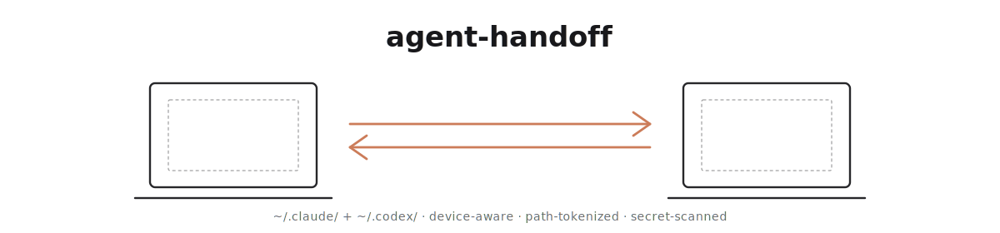

<div align="right">

**English** | [한국어](README.ko.md)

</div>

<picture>
  <source media="(prefers-color-scheme: dark)" srcset="docs/assets/hero-dark.svg">
  
</picture>

<p align="center">
  Hand off your agent setup between devices — sync <code>~/.claude/</code> or <code>~/.codex/</code> across machines.
</p>

---

## Why

If you use Claude Code or Codex on more than one machine — say a home Mac and a work Mac — moving hooks, skills, agents, rules, and local config between them is surprisingly painful. Copying files across often breaks because absolute paths like `/Users/your-home-name/…` don't exist on the other machine.

`agent-handoff` automates the whole thing. Per-machine paths are rewritten to portable tokens so configs resolve correctly wherever you pull them, a scanner catches secrets (API keys, tokens) before anything leaves your device, and a shared hub repository keeps every machine's configs and push history in one place.

Claude Code users can run it through slash commands. Codex users can use the same `handoff` CLI directly with `--profile codex`.

---

## Quick start

Inside Claude Code:

```
/plugin marketplace add im-ian/agent-handoff
/plugin install agent-handoff@agent-handoff
/reload-plugins
```

One-time terminal step (npm publish pending — see [Installation](#installation)):

```bash
git clone https://github.com/im-ian/agent-handoff.git && cd agent-handoff
npm install && npm run build && npm link
```

Then back in Claude Code:

```
/handoff-init       # asks you a few questions, creates a PRIVATE GitHub hub repo
/handoff-push       # snapshot ~/.claude/ to the hub
```

For Codex from the terminal:

```bash
handoff init --profile codex --hub git@github.com:you/agent-handoff-hub.git --device my-mac
handoff push
```

On another machine — after the same install + `/handoff-init`:

```
/handoff-pull       # pick the source device, preview diff, apply
```

Every slash command drives prompts through `AskUserQuestion` (device pickers, secret-scan policy, install confirmations) — no interactive CLI hangs, no flags to memorize.

---

## Installation

### 1. Claude Code plugin

```
/plugin marketplace add im-ian/agent-handoff
/plugin install agent-handoff@agent-handoff
/reload-plugins
```

Updates ride through `/plugin update`.

### Codex plugin

This repo also ships a Codex plugin at `plugins/agent-handoff/` with slash commands for the Codex profile. The repo-local marketplace entry lives at `.agents/plugins/marketplace.json`.

After adding/installing the local marketplace in Codex, the commands drive the same CLI with `--profile codex` where needed:

```
/init      # runs handoff init --profile codex ...
/push      # dry-run + secret policy + push
/pull      # source selection + preview + apply
/status    # current profile, app dir, hub, devices
```

### 2. `handoff` CLI backend

The plugin is a thin wrapper — every slash command shells out to a `handoff` binary on your PATH. Until npm publish lands, install from source:

```bash
git clone https://github.com/im-ian/agent-handoff.git && cd agent-handoff
npm install && npm run build && npm link
```

Verify with `/handoff-status` inside Claude Code — if it runs without "command not found", you're set. In terminal, `handoff --version` prints `1.0.0`.

### Uninstall

```
/plugin uninstall agent-handoff@agent-handoff
```

```bash
npm unlink -g @im-ian/agent-handoff   # CLI
rm -rf ~/.agent-handoff               # local config + hub clone (remote untouched)
```

---

## Slash commands

| Command | Purpose |
|---|---|
| `/handoff-init` | Register this device, link or create a hub repo. Interactively picks hub setup and device name. |
| `/handoff-push` | Snapshot the configured agent directory to the hub. Runs secret scan via `--dry-run` first; `AskUserQuestion` drives skip/allow/abort on findings. |
| `/handoff-pull` | Apply another device's snapshot. Shows the device list, previews the diff, asks before overwriting. |
| `/handoff-diff` | Preview what `pull` would change, without applying. |
| `/handoff-status` | Show this device's registration, hub URL, and all known devices with last-push timestamps. |
| `/handoff-doctor` | Diagnose missing external deps referenced by `hooks.json` — shows where each missing binary is used and how to install it. |
| `/handoff-bootstrap` | Install declared deps that are missing on this machine. Always shows the plan and asks before executing. |
| `/handoff-deps` | Manage the per-device `dependencies.json` (`add <name> --darwin "..." --linux "..."` / `list` / `remove`). |

---

## What gets synced

Conservative **allowlist** so unknown files never leak by accident. The default depends on the selected profile.

- **Claude default include:** `agents/**`, `commands/**`, `hooks/**`, `skills/**`, `rules/**`, `mcp-configs/**`, `memory/**`, top-level `*.md`
- **Codex default include:** `AGENTS.md`, `config.toml`, `hooks.json`, `rules/**`, `skills/**`, `commands/**`, `memories/**`, top-level `*.md`
- **Hard-deny (always excluded):** `projects/**`, `sessions/**`, `cache/**`, `telemetry/**`, `backups/**`, `*.log`, `*.jsonl`, `**/.credentials.json`, `**/.env*`, `**/*credentials*`, `**/*secret*`, `.DS_Store`
- **Custom:** edit `scope.include` / `scope.excludeExtra` in `~/.agent-handoff/config.json`. `excludeExtra` stacks on the hard-deny list.

---

## Tokenization

Hooks routinely embed absolute paths like `/Users/alice/.claude/hooks/format.sh`. Sync verbatim → username `bob` machine → every path breaks.

On push, two literals get rewritten to placeholders. On pull, they resolve back to the local machine's values:

| Token | Replaces |
|---|---|
| `${HANDOFF_CLAUDE}` | `$HOME/.claude` for the Claude profile |
| `${HANDOFF_CODEX}` | `$HOME/.codex` for the Codex profile |
| `${HANDOFF_HOME}` | `$HOME` |

So `"command": "node \"/Users/alice/.claude/hooks/x.js\""` becomes `"node \"${HANDOFF_CLAUDE}/hooks/x.js\""` in the hub, then on bob's machine resolves to `"node \"/Users/bob/.claude/hooks/x.js\""` — automatically correct. Longest pattern wins so path nesting stays right.

`${HANDOFF_USER}` / `${HANDOFF_HOSTNAME}` exist but are **off by default** — bare usernames false-positive into prose (`alice` → `malice`/`palace`). Opt in via `substitutions: [{ "from": "alice", "to": "${HANDOFF_USER}" }]` in config when needed.

---

## Secret scanner

Every scoped text file (≤ 2 MB) is scanned for: Anthropic/OpenAI/GitHub/Google/AWS/Slack tokens, private key headers, JWTs, generic `password=` / `api_key=` literals.

- **From `/handoff-push`.** A `--dry-run` preflight surfaces findings, then `AskUserQuestion` offers skip flagged / upload everything / abort. Public or unknown-visibility hubs get an extra warning.
- **From the terminal, interactive.** Per-file prompt: *skip* / *upload anyway* / *abort*. Non-private hubs require a typed `yes` confirmation.
- **False positives** (Django `SECRET_KEY` examples, test fixtures, password-pattern docs) → add file paths to `secretPolicy.allow` in config. Manual edits only — prevents click-fatigue from silently growing the list.

---

## Dependency management

Hooks invoke external CLIs (`gh`, `jq`, `clawd`, `rtk`, …). After a pull onto a fresh machine, those binaries may not be installed → hooks silently fail with `command not found`. Three slash commands address this:

```
/handoff-deps add gh --darwin "brew install gh" --linux "apt install gh"
/handoff-doctor            # confirm gh is declared; see what else is missing
/handoff-bootstrap         # install missing declared deps (shows plan, asks first)
```

- **`/handoff-doctor`** — read-only scan of `hooks/hooks.json`. Shows missing binaries with file:line context and a suggested fix from the manifest.
- **`/handoff-deps add/list/remove`** — edits the per-device manifest at `<hub>/devices/<name>/dependencies.json`. `add` and `remove` auto-commit and push.
- **`/handoff-bootstrap`** — installs declared deps that aren't on PATH. Always prints the install plan first, always requires confirmation. Pull *never* auto-installs anything.

v1 detects from `hooks/hooks.json` only; `scripts/**/*.sh` parsing comes in v1.1.

---

## Hub layout

```
<hub>/
├── devices/<name>/
│   ├── snapshot/            # tokenized scoped files
│   ├── version.json         # timestamp, file count, byte count, host
│   └── dependencies.json    # declared external deps for this device
└── manifest.json            # registry of all devices
```

One git commit on the hub = one push from one device. **N devices × M versions** emerges naturally from git history. No cross-device merging — `/handoff-pull --from X` always applies X's complete snapshot atomically.

---

## Configuration

`~/.agent-handoff/config.json` — full schema in [`docs/DESIGN.md`](docs/DESIGN.md). Most users never touch this file; `/handoff-init` writes a sensible default.

```json
{
  "device": "my-mac",
  "profile": "claude",
  "hubRemote": "https://github.com/<you>/<hub>.git",
  "appDir": "/Users/<you>/.claude",
  "scope": { "include": ["agents/**", "..."], "optIn": [], "excludeExtra": [] },
  "secretPolicy": { "allow": [] },
  "substitutions": []
}
```

`AGENT_HANDOFF_HOME` env var overrides the config/hub location (default `~/.agent-handoff/`) — useful for safe trial runs (`AGENT_HANDOFF_HOME=/tmp/trial handoff init …`) and per-user isolation in shared environments.

---

## Terminal usage (optional)

Every slash command is a thin wrapper around a matching `handoff <subcommand>` in your shell. If you prefer the terminal, `handoff init`, `handoff push`, `handoff pull --from <device>`, `handoff doctor`, etc. all work identically — same flags, same output. `handoff <cmd> --help` for the full flag listing.

---

## Troubleshooting

- **`fatal: could not read Password for 'https://…@github.com'`** — set a local credential helper for the hub clone:
  ```bash
  git -C ~/.agent-handoff/hub config --local credential.helper '!gh auth git-credential'
  ```
  Multi-account: `gh auth switch --user <login>` first.

- **Hub visibility `UNKNOWN`** — non-GitHub host or `gh` missing/unauthenticated. Treated as potentially public; requires typed `yes` per file with findings.

- **Scope-change churn** — widening shows new files as `added`; narrowing leaves stale snapshot files (the hub doesn't auto-prune). Re-push from the owning device to rewrite its snapshot.

---

## Status

**v1.0.0** — stable. Used in production across multiple devices. npm publish pending.

**Roadmap:** `handoff log --device <name>`, `handoff pull --at <sha>`, auto credential-helper setup on `init`, `scripts/**/*.sh` parsing in `doctor`, SessionStart-hook integration (opt-in "soft handoff"), npm release.

---

## Related work

[`claude-teleport`](https://github.com/seilk/claude-teleport) by [@seilk](https://github.com/seilk) covers the same space — "sync agent setup across machines via a private GitHub repo" — and `agent-handoff` was directly inspired by it. The two projects ended up with different architectural choices worth understanding before picking one:

| | claude-teleport | agent-handoff |
|---|---|---|
| Storage model | Branch-per-device, auto-merged into `main` | Directory-per-device (`devices/<name>/`) on `main`, no merging |
| Cross-device paths | Synced verbatim | Tokenized — `${HANDOFF_CLAUDE}` / `${HANDOFF_HOME}` so a hook written on `/Users/alice/…` runs correctly on `/Users/bob/…` |
| External dep tracking | — | `doctor` / `bootstrap` / `deps` surface missing CLIs referenced by hooks |
| Public sharing | `teleport-share` / `teleport-from <user>` | Private-hub only (by design) |
| Plugin cache | Synced (plugins + marketplaces included) | Excluded — reinstall via `/plugin install` on each machine |

If you want a branch-merged single-source-of-truth with public sharing, pick teleport. If you want per-device isolation, path tokenization, and external-dep tracking, pick this one.

**Why a separate project, not a PR?** The storage model (directory vs. branch), path tokenization, and dep-tracking surface touch every command — they aren't a patch, they're a different set of tradeoffs in the same problem space. seilk's design is coherent for its use case; `agent-handoff` explores different ones.

Dotfile managers (`chezmoi`, `yadm`, `stow`) also solve the broader sync problem, but require manual templating for path differences. Both projects above skip that by baking in knowledge of Claude Code's directory shape.

---

## License

MIT
